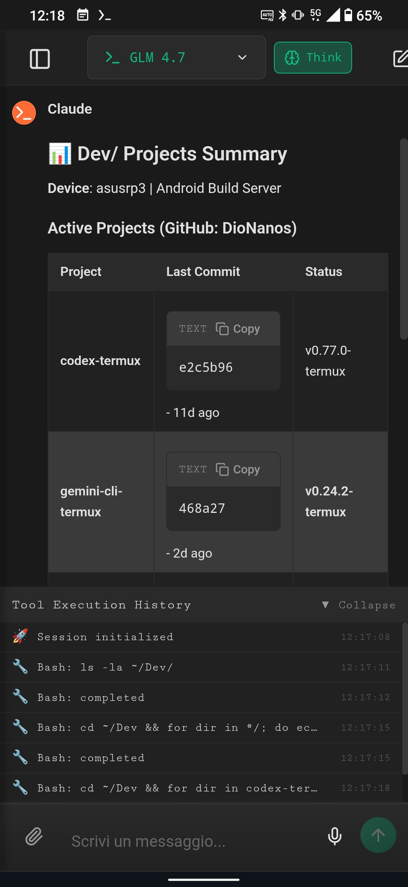

# NexusCLI — AI Terminal Cockpit

<p align="center">
  
</p>

---

## Overview

NexusCLI is a lightweight, Termux-first AI cockpit that orchestrates Claude Code, Codex CLI, Gemini CLI, and Qwen Code CLI from a single web/terminal UI. It supports live streaming, interrupts, session resume, workspace isolation, and remote voice input with auto HTTPS setup.

---

[](https://www.npmjs.com/package/@mmmbuto/nexuscli)
[](https://www.npmjs.com/package/@mmmbuto/nexuscli)
[](https://ko-fi.com/dionanos)

---

## Screenshots

<p align="center">
  
  
</p>

---

## Highlights (v0.9.9)

- **Auto-update**: Update check on start (npm + GitHub) with interactive prompt
- **Update command**: `nexuscli update` / `nexuscli upgrade` (stop → update → restart)
- **Live default model**: UI refreshes config on focus/interval without restart
- **Restart warnings**: CLI warns when changes require stop/start

### Stable (v0.9.9)

- Update check is cached and non-blocking for normal startup
- GitHub-only releases show a notice without prompting

## Features

- Multi-engine orchestration (Claude, Codex, Gemini, Qwen)
- SSE streaming with realtime tool statusbar
- Interrupt/stop per engine
- Session resume + native session import across engines
- Workspace isolation, switching, and history
- File & image attachments (vision models supported)
- Model selector (think mode + reasoning levels where available)
- Voice input (browser STT, optional Whisper via OpenAI key)
- Conversation search + pin/bookmark
- Built-in jobs runner API for shell tasks
- Config API + rate limiting on chat endpoints

## Supported Engines

| Engine | Models | Provider |
|--------|--------|----------|
| **Claude (native)** | Opus 4.5, Sonnet 4.5, Haiku 4.5 | Anthropic |
| **Claude-compatible** | DeepSeek (deepseek-*), GLM-4.7 | DeepSeek, Z.ai |
| **Codex** | GPT-5.2 Codex, GPT-5.2, GPT-5.1 Codex (Mini/Max), GPT-5.1 | OpenAI |
| **Gemini** | Gemini 3 Pro Preview, Gemini 3 Flash Preview | Google |
| **Qwen** | coder-model, vision-model | Alibaba |

---

## Install

```bash
# From npm
npm install -g @mmmbuto/nexuscli

# From GitHub
npm install -g github:DioNanos/nexuscli
```

### Release Channels

```bash
# Latest (default)
npm install -g @mmmbuto/nexuscli

# Stable channel (pinned)
npm install -g @mmmbuto/nexuscli@stable
```

## Setup

```bash
nexuscli init
```

## Start

```bash
nexuscli start
```

### Network Access

| Protocol | Port | URL | Use Case |
|----------|------|-----|----------|
| **HTTP** | 41800 | `http://localhost:41800` | Local access |
| **HTTPS** | 41801 | `https://<ip>:41801` | Remote access, voice input |

> **Note**: HTTPS is required for microphone access from remote devices (browser security).
> Self-signed certificates are auto-generated on first run.

---

## Commands (CLI)

| Command | Description |
|---------|-------------|
| `nexuscli init` | Setup wizard (config, certs, data) |
| `nexuscli start` | Start server (HTTP 41800 / HTTPS 41801) |
| `nexuscli stop` | Stop server |
| `nexuscli status` | Status and available engines |
| `nexuscli engines` | Manage engines |
| `nexuscli workspaces` | Manage workspaces |
| `nexuscli model` | Default model |
| `nexuscli api` | Additional API keys (e.g., Whisper) |
| `nexuscli logs` | View server logs |
| `nexuscli users` | Users |
| `nexuscli setup-termux` | Termux helpers (services, paths) |
| `nexuscli update` | Update NexusCLI and restart server |
| `nexuscli upgrade` | Alias for update |
| `nexuscli uninstall` | Remove NexusCLI |

---

> **Note**: On `nexuscli start`, an update check runs (cached) and will prompt in interactive shells.

## API Keys

Configure API keys for additional providers:

```bash
nexuscli api list                     # List configured keys
nexuscli api set deepseek <key>       # DeepSeek models
nexuscli api set zai <key>            # GLM-4.7 (Z.ai Anthropic-compatible)
nexuscli api set openai <key>         # Voice input (Whisper STT)
nexuscli api set openrouter <key>     # Future: Multi-provider gateway
nexuscli api delete <provider>        # Remove key
```

> **Note**: Claude/Codex/Gemini/Qwen keys are managed by their respective CLIs.
> OpenAI key enables voice input via Whisper. HTTPS auto-generated for remote mic access.

---

## Requirements

- Node.js 18+
- At least one CLI installed:
  - Claude Code CLI (`claude`)
  - Codex CLI (`codex`)
  - Gemini CLI (`gemini`)
  - Qwen Code CLI (`qwen`)

---

## Termux-First Architecture

NexusCLI is designed primarily for **Termux** on Android devices.

### Stack

- **Termux** - primary runtime environment
- **tmux** - session management
- **Node.js + SSE** - lightweight backend
- **React** - minimal UI

### Purpose

This project exists to study:

- terminal-driven AI orchestration
- ultra-light architectures for constrained devices
- mobile development workflows

It is a **research and learning tool**.

---

## API Endpoints

| Endpoint | Engine | Description |
|----------|--------|-------------|
| `POST /api/v1/chat` | Claude | SSE streaming chat |
| `POST /api/v1/codex` | Codex | SSE streaming chat |
| `POST /api/v1/gemini` | Gemini | SSE streaming chat |
| `POST /api/v1/qwen` | Qwen | SSE streaming chat |
| `POST /api/v1/chat/interrupt` | Claude | Stop running generation |
| `POST /api/v1/codex/interrupt` | Codex | Stop running generation |
| `POST /api/v1/gemini/interrupt` | Gemini | Stop running generation |
| `POST /api/v1/qwen/interrupt` | Qwen | Stop running generation |
| `GET /api/v1/models` | All | List available models |
| `GET /api/v1/config` | - | Get user preferences (default model) |
| `POST /api/v1/sessions/import` | - | Import native sessions (admin) |
| `POST /api/v1/jobs` | - | Run a background job (SSE stream) |
| `GET /api/v1/workspaces` | - | List workspaces from sessions |
| `GET /health` | - | Health check |

---

## Development

```bash
# Clone
git clone https://github.com/DioNanos/nexuscli.git
cd nexuscli

# Install deps
npm install
cd frontend && npm install && npm run build && cd ..

# Run dev
npm run dev
```

---

## License

MIT License.
See `LICENSE` for details.
