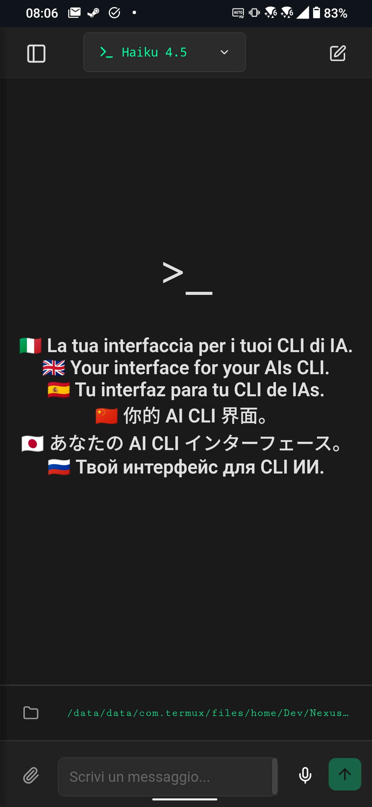
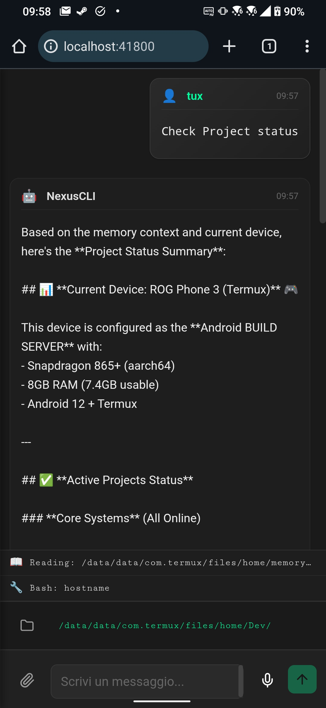

# NexusCLI — AI Terminal Cockpit

<p align="center">
  
</p>


---

## Overview

NexusCLI is a lightweight AI cockpit (Termux-first) to orchestrate Claude Code, Codex CLI, and Gemini CLI from the web/terminal, with live interrupt and native session resume.

---

[](https://www.npmjs.com/package/@mmmbuto/nexuscli)
[](https://www.npmjs.com/package/@mmmbuto/nexuscli)
[](https://ko-fi.com/dionanos)

---

## Screenshots

<p align="center">
  
  
</p>

---

## Highlights (v0.8.6)

- Multi-engine: Claude, Codex, Gemini
- Native resume: same engine resumes the session; switching engines uses handoff with summary/history
- Reliable stop: stop button interrupts the active process (Claude/Codex/Gemini)
- Session import: on startup it imports native sessions from ~/.claude ~/.codex ~/.gemini; manual endpoint `POST /api/v1/sessions/import`
- Voice input (Whisper), auto HTTPS for remote microphone
- Mobile-first UI with SSE streaming and explicit workspace selection
- Termux: postinstall installs `ripgrep`; Claude wrapper auto-patches missing `vendor/ripgrep/arm64-android/rg`; Codex parser exposes threadId to prevent crash on exit
- UI: modernized floating input, circular send/stop, updated chat bubbles/icons and markdown rendering
- Gemini fallback: clearly surfaces missing `pty.node` and prevents empty replies; input bar stays centered even with image attachments

## Supported Engines

| Engine | Models | Provider |
|--------|--------|----------|
| **Claude** | Opus 4.5, Sonnet 4.5, Haiku 4.5 | Anthropic |
| **Codex** | GPT-5.1, GPT-5.1 Codex (Mini/Max) | OpenAI |
| **Gemini** | Gemini 3 Pro Preview | Google |

---

## Install

```bash
# From npm
npm install -g @mmmbuto/nexuscli

# From GitHub
npm install -g github:DioNanos/nexuscli
```

## Setup

```bash
nexuscli init
```

## Start

```bash
nexuscli start
```

### Network Access

| Protocol | Port | URL | Use Case |
|----------|------|-----|----------|
| **HTTP** | 41800 | `http://localhost:41800` | Local access |
| **HTTPS** | 41801 | `https://<ip>:41801` | Remote access, voice input |

> **Note**: HTTPS is required for microphone access from remote devices (browser security).
> Self-signed certificates are auto-generated on first run.

---

## Commands (CLI)

| Command | Description |
|---------|-------------|
| `nexuscli init` | Setup wizard (config, certs, data) |
| `nexuscli start` | Start server (HTTP 41800 / HTTPS 41801) |
| `nexuscli stop` | Stop server |
| `nexuscli status` | Status and available engines |
| `nexuscli engines` | Manage engines |
| `nexuscli workspaces` | Manage workspaces |
| `nexuscli model` | Default model |
| `nexuscli api` | Additional API keys (e.g., Whisper) |
| `nexuscli users` | Users |
| `POST /api/v1/sessions/import` | Import native sessions (admin) |

---

## API Keys

Configure API keys for additional providers:

```bash
nexuscli api list                     # List configured keys
nexuscli api set deepseek <key>       # DeepSeek models
nexuscli api set openai <key>         # Voice input (Whisper STT)
nexuscli api set openrouter <key>     # Future: Multi-provider gateway
nexuscli api delete <provider>        # Remove key
```

> **Note**: Claude/Codex/Gemini keys are managed by their respective CLIs.
> OpenAI key enables voice input via Whisper. HTTPS auto-generated for remote mic access.

---

## Requirements

- Node.js 18+
- At least one CLI installed:
  - Claude Code CLI (`claude`)
  - Codex CLI (`codex`)
  - Gemini CLI (`gemini`)

---

## Termux-First Architecture

NexusCLI is designed primarily for **Termux** on Android devices.

### Stack

- **Termux** - primary runtime environment
- **tmux** - session management
- **Node.js + SSE** - lightweight backend
- **React** - minimal UI

### Purpose

This project exists to study:

- terminal-driven AI orchestration
- ultra-light architectures for constrained devices
- mobile development workflows

It is a **research and learning tool**.

---

## API Endpoints

| Endpoint | Engine | Description |
|----------|--------|-------------|
| `POST /api/v1/chat` | Claude | SSE streaming chat |
| `POST /api/v1/codex` | Codex | SSE streaming chat |
| `POST /api/v1/gemini` | Gemini | SSE streaming chat |
| `POST /api/v1/chat/interrupt` | Claude | Stop running generation |
| `POST /api/v1/codex/interrupt` | Codex | Stop running generation |
| `POST /api/v1/gemini/interrupt` | Gemini | Stop running generation |
| `GET /api/v1/models` | All | List available models |
| `GET /api/v1/config` | - | Get user preferences (default model) |
| `GET /health` | - | Health check |

---

## Development

```bash
# Clone
git clone https://github.com/DioNanos/nexuscli.git
cd nexuscli

# Install deps
npm install
cd frontend && npm install && npm run build && cd ..

# Run dev
npm run dev
```

---

## License

MIT License.
See `LICENSE` for details.
